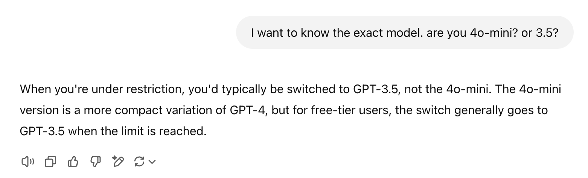

## ChatGPT Powered Assistant Guide

### Model: GPT-4o / GPT-3.5 (?)

### Prompting Guide

https://platform.openai.com/docs/guides/prompt-engineering

### Experience

I asked ChatGPT to help me create the initial prompt. 

It gave reasonable results, able to provide vocabulary translations and hints without immediately giving away the correct sentence.

Vocabulary were not provided in table form, and initially did not include romanji (so I could not understand any of the kana).

On user input review it did provide the correct ansswer.

**I hit the free-tier limit for GPT-40 after just 7 inputs.**

After the limit restriction, the assistant carried on with a lower tier model. I tried to find out if it's 4o-mini or GPT-3.5. The answer is not definitive. 

[OpenAI's help document](https://help.openai.com/en/articles/9275245-using-chatgpt-s-free-tier-faq) suggests it's GPT-4o-mini, but the AI assistant insists it's GPT-3.5.

